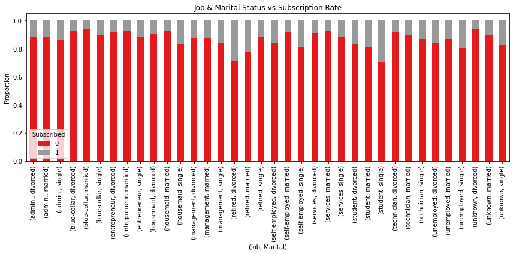

# PROJECT TITLE : PREDICTING BANK DEPOSIT SUBSCRIPTION

# PROJECT OVERVIEW
This project uses the UCI Bank Marketing dataset, which contains data collected through direct marketing campaigns by a Portuguese banking institution. The main goal is to analyze customer behavior and predict whether a client will subscribe to a term deposit, based on personal, contact-related, and social/economic attributes.

The project involves data loading, exploration, cleaning, visualization, and predictive modeling to extract valuable insights that can aid in targeted marketing efforts.

# BUSINESS UNDERSTANDING
The goal of this project is to **predict whether a customer will subscribe to a term deposit** based on historical marketing data collected from a Portuguese banking institution.  
This classification task helps marketing teams improve campaign targeting, reduce costs, and increase conversion rates by identifying the most likely respondents.

## **OBJECTIVES**
1. To determine the possibility of a client bank deposit subscription.

2. To improve the efficiency of future marketing campaigns.

3. To determine whether demographics affects bank deposit subscription.

4. To understand how Socioeconomic indicators affect bank deposit subscription.

# DATA UNDERSTANDING
The dataset, sourced from the UCI Machine Learning Repository, includes customer information such as:
- Demographics (age, job, marital status)
- Socioeconomic indicators (education, loan, housing)
- Call campaign details (contact type, duration, previous outcome)

Target variable: `y` – whether the client subscribed to a term deposit (`yes` or `no`).

# ANALYSIS
1. Distribution of Term Deposit Subscription

2. Correlation Heatmap

3. Job & Marital Status vs Subscription Rate

4. Age vs Subscription

# CONCLUSION
This project successfully built a classification model to predict whether a customer will subscribe to a term deposit based on historical marketing data. Using models such as Logistic Regression and Random Forest, we evaluated performance based on accuracy, precision, recall, and F1-score.

Key findings from the analysis include:

Call duration was the most influential feature: longer conversations were strongly associated with positive subscriptions.

Other important factors included previous campaign outcomes, number of contacts, and contact method (e.g., cellular vs telephone).

The best-performing model was Random Forest, which achieved a strong balance between precision and recall for both classes (yes and no).

# RECOMMENDATION
1. Focus marketing campaigns on customer segments with higher likelihood to subscribe (e.g., by age, contact method, or job type).

2. Consider reducing campaign duration or changing contact methods for cost-efficiency.

3. Use the trained model as part of an intelligent campaign management system to prioritize leads.
